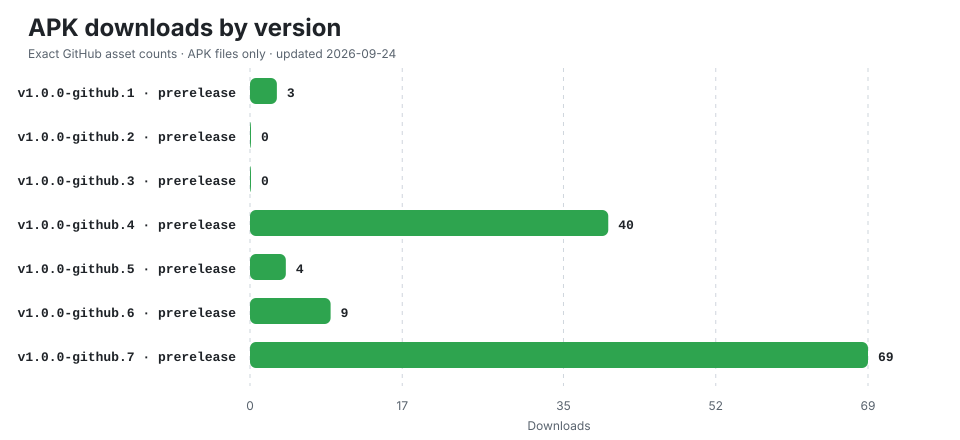

# Wisp Wallet for Android

Official APK distribution repository for Wisp Wallet while Google Play distribution is being prepared.

## Download

Install APK files only from this repository's [Releases](https://github.com/windvex/wisp-wallet-releases/releases) page. Each release includes a SHA-256 checksum for verification.

Current GitHub builds target 64-bit Android devices (`arm64-v8a`) and may be marked as prerelease while testing continues.

## Download statistics

[View exact per-version and per-asset counts](./DOWNLOADS.md)

Statistics are generated automatically from GitHub's Releases API. Only uploaded `.apk` assets are counted; checksums, source archives, drafts, and other files are excluded. Counts represent asset downloads, not unique users, devices, or installations.

## Security

- Wisp will never ask for a seed phrase, private key, PIN, or password through GitHub.
- Do not install APK files reposted by third parties.
- Verify the published SHA-256 checksum before installation.
- Back up wallet recovery information securely before replacing or removing an installed wallet.

GitHub APKs use the Android signing credentials managed by EAS. Current signing certificate SHA-256:

`64:DE:F5:E4:D5:5F:F2:14:49:28:2B:E0:0D:12:EE:FE:E2:8E:29:AE:6C:9B:1A:D4:08:B6:2C:82:34:EE:EC:1A`

A future Google Play build may use a different Play App Signing certificate and therefore may not update this installation in place.
